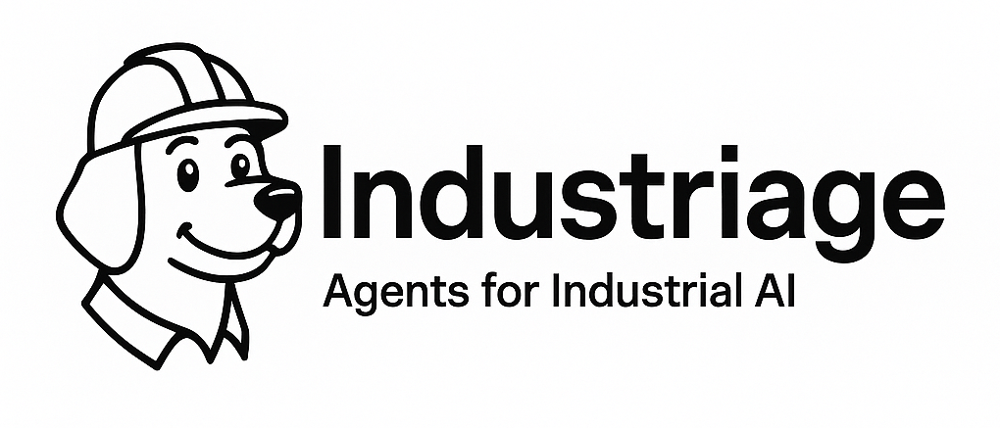

# Industriage – Agents for Industrial AI



### Smarter Workflows. Loyal Agents.

## Quick Start

```bash
# Install dependencies
uv sync

# Run workflow evaluation
bash run_workflow.sh

# Test with interactive dashboard
python test/start_dashboard.py
```

## Architecture

### Workflows
- **Primary**: Voice transcripts → Work requests/orders
- **Secondary**: Closing comments → Completion records

Each workflow contains:
```
workflows/[name]/
├── agents/           # Agent JSON configurations
├── graph.json       # Workflow structure
├── state.py         # Output schemas
└── workflow.py      # Implementation
```

### Agent Structure

Agents are defined in JSON with:
```json
{
  "name": "agent_name",
  "description": "Agent description", 
  "prompt": "System prompt with {{escaped}} JSON examples"
}
```

**Key**: Escape curly braces in prompts with `{{}}` for ChatPromptTemplate compatibility.

### Graph Configuration

Simple workflow definition:
```json
{
  "agents": {
    "agent_name": {
      "name": "agent_name",
      "path": "agents/agent_name.json"
    }
  },
  "edges": [
    ["START", "agent_name"],
    ["agent_name", "END"]
  ]
}
```

## Adding New Workflows

1. **Create workflow directory**: `workflows/new_workflow/`
2. **Define agents**: Add JSON files to `agents/`
3. **Configure graph**: Create `graph.json` with agents and edges
4. **Define schema**: Create `state.py` with Pydantic models
5. **Implement workflow**: Create `workflow.py` extending `BaseWorkflow`

## Adding Evaluation Metrics

Create new metrics in `src/base/evaluator.py`:

```python
class CustomMetric(BaseMetric):
    @property
    def name(self) -> str:
        return "custom_metric_name"
    
    def evaluate(self, input_text: str, actual_output: Dict[str, Any], 
                expected_output: Optional[Dict[str, Any]] = None) -> float:
        # Return score 0.0-1.0
        return score
```

Add to workflow evaluation framework:
```python
framework.add_metric(CustomMetric())
```

## Voice Testing

### Interactive Dashboard
```bash
python test/start_dashboard.py
# Opens http://localhost:5001
```

Features:
- **Voice input**: Click mic button for speech-to-text
- **Text input**: Manual transcript entry
- **Model selection**: GPT-4, Claude variants
- **Real-time results**: JSON output display
- **History tracking**: Last 10 test results

### Dataset Evaluation
```bash
python run_workflow.py primary datasets/primary_dataset.json --model gpt-4o-mini
```

Outputs saved to `outputs/[workflow]/[timestamp]_[model]/`:
- `dashboard.html` - Interactive results
- `results.json` - Raw evaluation data
- `classification_report.txt` - Text summary
- `workflow_graph.png` - Visual workflow

## Current Metrics

- **Schema Validity**: Output matches expected Pydantic schema
- **Category Classification**: Correct work request/order/task categorization  
- **Asset Identification**: Accurate equipment ID mapping
- **Downtime Extraction**: Equipment downtime vs work duration
- **Completeness**: Required fields populated

## Development

```bash
# Validate workflow
python run_workflow.py validate-workflow primary

# List available workflows  
python run_workflow.py list-workflows

# Debug with breakpoints
python -m pdb run_workflow.py primary datasets/primary_dataset.json